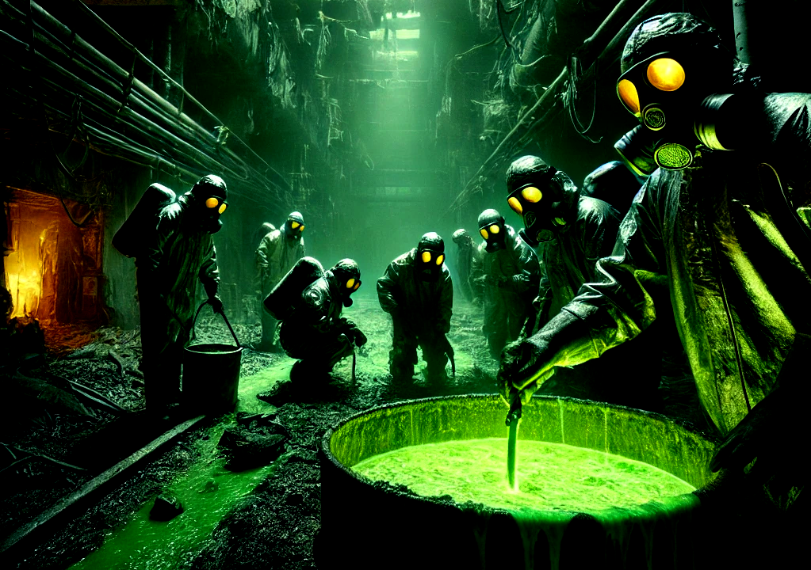

# Stellar Corium



> **A little bit of our history:**
>
> Fuel-Containing Material (or FCM), a material so rare and dangerous that it can only be created by a nuclear
> meltdown accident... they called it Corium.
>
> What made Corium extraordinary was its potential as a fuel source. Scientists quickly realized that it held the
> key to unlocking the secrets of faster-than-light travel. Its unique properties, when harnessed correctly, could warp
> the very fabric of space-time, opening pathways to distant galaxies and uncharted realms. For the first time, the
> dream of interstellar voyages was within their grasp.
>
> But with this discovery came a terrible realization. Corium is also one of the most lethal substances ever known, and
> it's something we have known for decades. Its radioactive emissions are off the scale, capable of annihilating anyone
> in just minutes or even seconds if the material hasn't decay enough. Even in its inert state, it's a ticking time
> bomb, threatening to unleash devastation on any who dared to wield it...
>
> Yet, the promise of the stars is too alluring to resist. Across the galaxy, leaders, scientists, and adventurers
> faced an impossible choice: to embrace Corium and reach for the heavens, or to forsake it and remain bound to their
> life, safe but forever grounded. In the end, the lure of the unknown proved too powerful. The race to harness
> Corium began... Are you ready?

## A proof of work Stellar Asset

> IMPORTANT: This contract has not been audited nor have been fully tested yet, take this into consideration

FCM is a Stellar Asset that can only be created by mining it through this contract, only one unit (1_0000000) of the
asset can be mined per ledger, this means that at best we should be one emission of one unit per 5-7 seconds (avg.
ledger closing time). But because one unit per ledger means a really fast emission, the protocol understands that its
goal is to only emit one unit per minute and so it tries to adjust the Difficulty of the mining to try that.

## The mining process

The contract has a method called `mine` which looks like this:

```rust
pub trait ReactorContractTrait {
    //--- Other methods

    fn mine(e: Env, hash: BytesN<32>, message: String, nonce: u64, miner: Address);

    //--- Other methods
}
```

Miners will call this method providing a hash that matches the difficulty of the protocol, this hash will be generated
by the protocol using the other parameters you provide to the method. The hash should be generated using/following the
next logic:

```rust
pub fn create_block_hash(
    e: &Env,
    index: &u64,
    message: &String,
    prev_hash: &BytesN<32>,
    nonce: &u64,
    miner: &Address,
) -> BytesN<32> {
    let mut builder: Bytes = Bytes::new(&e);
    builder.append(&index.to_xdr(&e));
    builder.append(&message.clone().to_xdr(&e));
    builder.append(&prev_hash.clone().to_xdr(&e));
    builder.append(&nonce.to_xdr(&e));
    builder.append(&miner.to_xdr(&e));

    e.crypto().keccak256(&builder).to_bytes()
}
```

You can generate the hash using the language of your preference, as long as the same hash is reproduced by the contract
and it complies with the current Difficulty, it will be accepted as a valid hash.

## Mining Attempts


> Once FCM was found, a race to mine it started and there was no going back... people got greedy, the idea of having
> such a weird asset in their hands was too good to ignore... its green looking glow was just like some kind of drug,
> you
> could stare at it for hours without getting tired of it. More tools and new ways to mine were discovered to the point
> where miners were consuming more energy than what they were able to generate with what they found, not because such
> thing wasn't capable of generating but because we didn't even know what to do with it.
>
> I still remember that Saturday when I heard that sound... It was all gone, it was such a horrible sound and yet so
> calm a few seconds later. The main plant that was being used by miners exploded with many people inside, we don't know
> yet what happened but those who are still alive think it was because of too much heat produced by miners.
>
> But that wasn't enough to scare miners, they still went inside and and look for more like if nothing happened... but
> there was a problem, because of the explosion there was some kind of a second meltdown and now the corium wasn't
> easily
> visible, yeah it was easier to find blocks since they were also everywhere and were emitting its particular radiation
> but you could find a block and once you open it there was nothing inside.
>
> What started as a race of who finds the block faster mutated into a game of not only the faster... but also the
> luckiest.

The second phase of the contract introduced the concept of "attempts", this means that during the mining period (each
block is mined each minute) there can be multiple miners trying to get the new block.

Each time a miner calls the `mine` method, it will be added to the list of miners attempting to get the new block (this
list has a limit of 255 participants). Once the block is finally mined after the minute has passed, a random miner will
be selected from the list by the contract and that one will receive the new FCM.

If a miner calls the `mine` method again and it is already listed, the process will be ignored but the call will run
ok... better to have an efficient miner if you don't want to waste fee.

## Protocol Difficulty

The difficulty of the protocol is set by the finder of the mine, the variation of difficulty is done by adding zeroes to
the front of the hash, so for example if the difficulty is 3 then your hash should have 3 zeroes in the front to
be valid.

After the recent explosion of the plant, the difficulty stayed at 6 thanks to the fact that there are radioactive blocks
everywhere... But we never know when the difficulty will start being variable again.

## Staking process

With time, miners need to go deeper and deeper if they want to find more Corium, but that also means you need more
energy and more protection to reach it. Ironically, the deadly Corium is your best bet for this job and so you can stake
it to fuel this operation... But be careful, we all know that once FCM is active you need to wait until it cools
down or otherwise you will die once you touch it again ;D. So once you stake it, you will need to wait 60 days before
you can take your FCM back. Plan wisely.

For every 10,000 FCM (10_000_0000000) minted by the contract you will need to stake 1 of them (1_0000000) in the
contract so you have enough energy to continue.

> Note: you can stake more FCM after you already staked some before, every time you stake more FCM, the timer to cool it
> down will be restarted.

## F*ckin nuke it!

Just like a rogue AI who tries to kill all humans... mining FCM can destroy things if we ever reach the point where the
Stellar network is being affected by this protocol, we will nuke it (calling the `fkin_nuke_it` method) so no more
mining will be possible after that. So mine all the FCM while you can ;)
